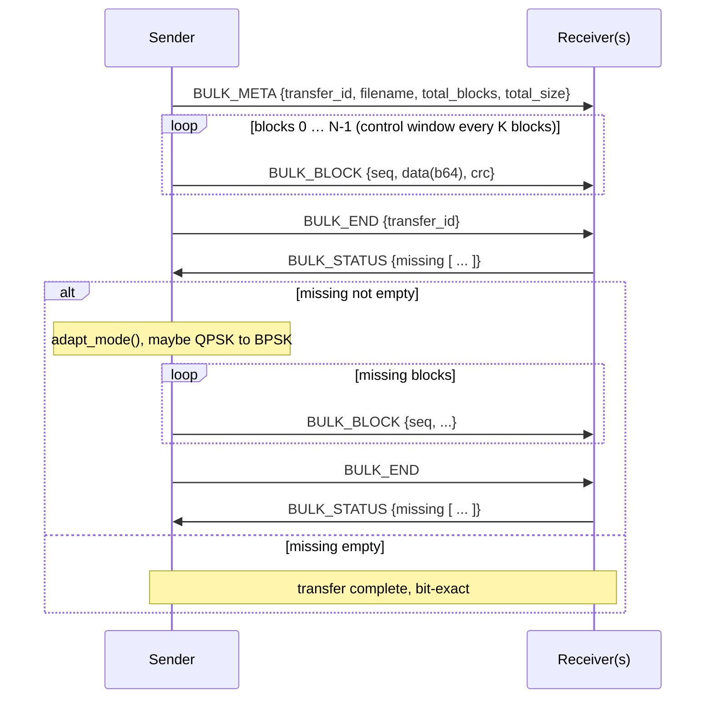
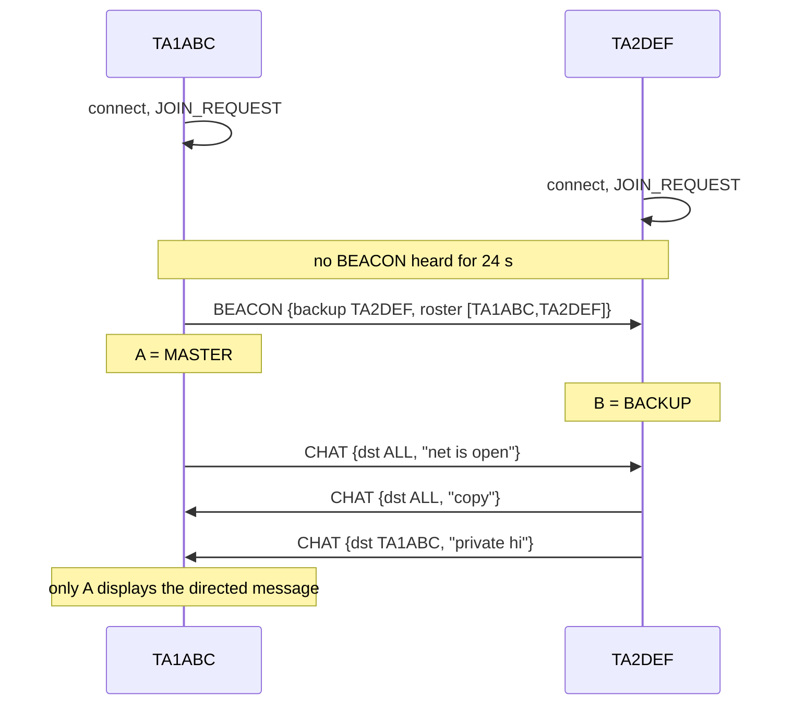
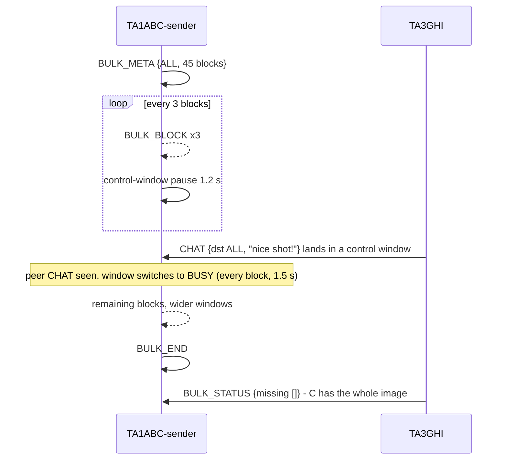
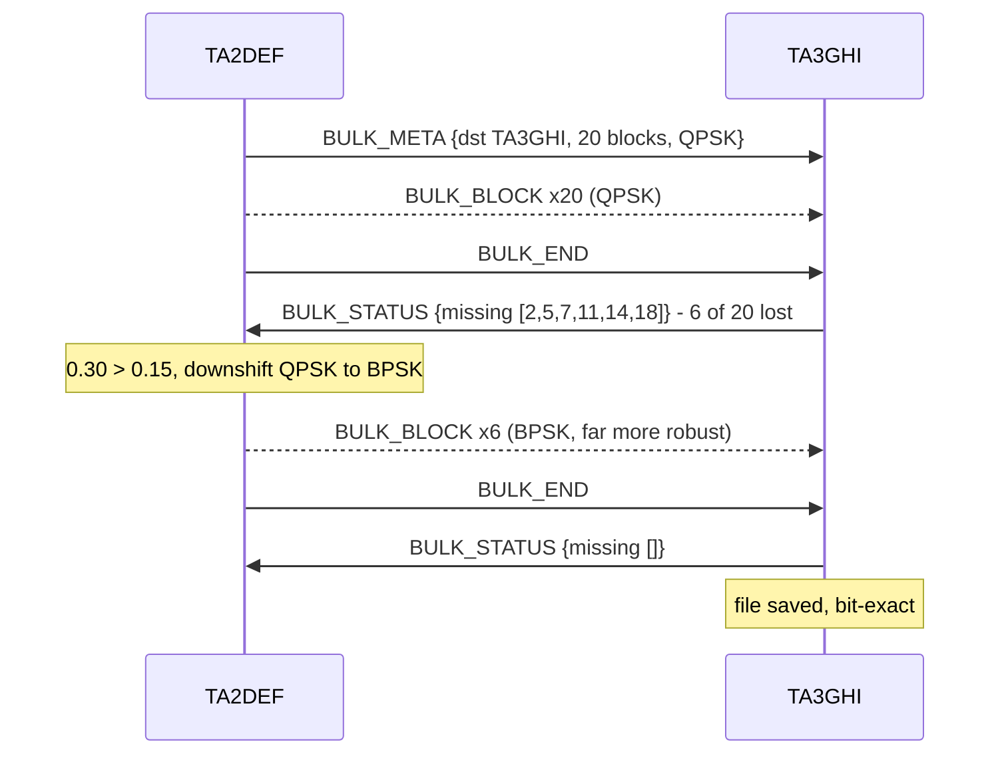
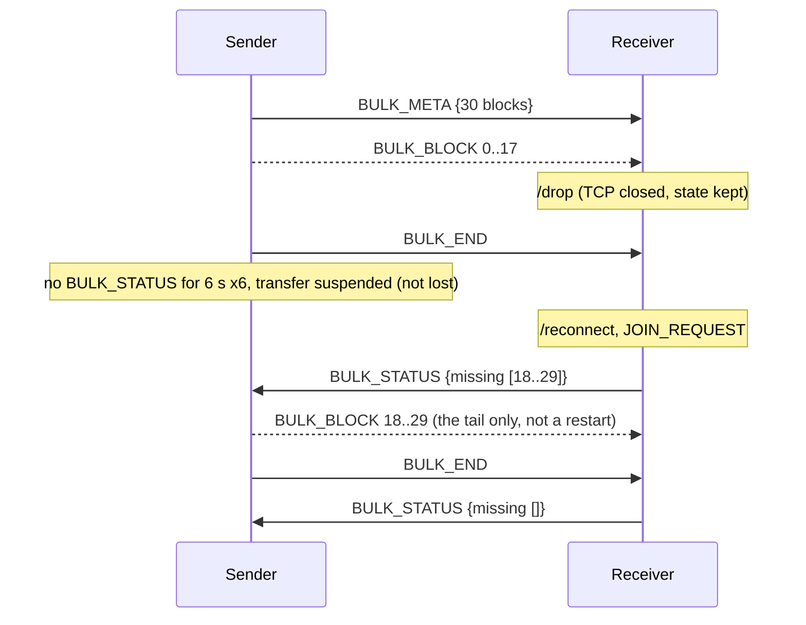

# ATCHAT Protocol Specification

> **Status:** software design + simulation. The modem is a real OFDM
> modulator/demodulator producing and decoding real audio; the "channel" is a
> TCP server that carries those audio samples and can add real AWGN / multipath.
> Nothing here is wired to an SDR or a sound card yet. Version described:
> **0.1.1**.

ATCHAT is a digital mode for amateur radio: as simple to operate as SSTV, but
robust, and able to carry **image/file transfer with error correction (ARQ)**
plus **multi-station chat (NET)** inside a single **2.7 kHz SSB** channel. It is
inspired by KG-STV, EasyPal and HSModem.

This document specifies the protocol from the waveform up: the PHY (OFDM modem),
the channel-access layer, the NET protocol frames, the session state machines,
and worked end-to-end scenarios.

---

## 1. Layering model

```
┌──────────────────────────────────────────────────────────────┐
│ NET protocol   (client.py / rust crate `protocol`)           │
│  master election & multi-level failover, roster,             │
│  broadcast + directed chat, block/CRC/ARQ file transfer,     │
│  control window, adaptive modulation, drop/resume            │
├──────────────────────────────────────────────────────────────┤
│ Channel access (channel_server.py / rust crate `channel`)    │
│  half-duplex arbitration (one TX at a time), broadcast to    │
│  all, real impairments (AWGN, multipath). NO protocol logic. │
├──────────────────────────────────────────────────────────────┤
│ PHY / modem    (modem.py / rust crate `modem`)               │
│  OFDM: preamble + header + data symbols, CRC-32, no FEC      │
└──────────────────────────────────────────────────────────────┘
```

The split is deliberate. Moving to a real radio is expected to replace only the
**channel-access** layer (TCP transport → sound card / SDR); the PHY and the NET
protocol stay as they are.

Two independent implementations track each other bit-for-bit: the reference
**Python** (`*.py` at the repo root) and a **Rust** port (`rust/`), verified
against each other with cross-vectors.

---

## 2. PHY layer — the OFDM modem

### 2.1 Parameters

| Parameter | Symbol | Value | Notes |
|---|---|---|---|
| Sample rate | `SAMPLE_RATE` | 8000 Hz | audio pass-band |
| FFT size | `N` | 256 | subcarrier spacing = 8000/256 = **31.25 Hz** |
| Cyclic prefix / guard | `CP_LEN` | 64 samples | **8 ms** guard interval |
| OFDM symbol length | `SYMBOL_LEN` | 320 samples | `N + CP_LEN` → **40 ms** on air per symbol |
| Data subcarriers | `DATA_CARRIERS` | bins 10…86 (77 carriers) | **312.5 Hz … 2687.5 Hz** — inside 2.7 kHz |
| Preamble subcarriers | `PREAMBLE_CARRIERS` | even bins 2,4,…,126 (63 carriers) | Schmidl-Cox: even bins → 2 identical time-domain halves |
| Header bits | `HEADER_BITS` | 17 | 16-bit length + 1-bit mode flag |
| Header repetition | `HEADER_REPEAT` | 4 | majority-voted at RX |
| Reference carrier | `DATA_CARRIERS[0]` (bin 10) | fixed `1+0j` | carries no data; phase reference for differential coding |
| Info carriers | — | 76 | `DATA_CARRIERS` minus the reference |
| Integrity | — | CRC-32 (IEEE, `zlib.crc32`) | **no FEC / LDPC / RS** — correction is the NET layer's ARQ |

The fixed preamble sequence is `numpy.random.RandomState(1234).choice([1,-1],
63)` — a constant both ends know. The Rust port embeds the same sequence.

### 2.2 On-air waveform structure

```
│ lead-in │ PREAMBLE │ HEADER │ DATA #0 │ DATA #1 │ … │ DATA #M-1 │ tail │
│ 20..299 │   320    │  320   │   320   │   320   │   │    320    │  64  │   samples
│ zeros   │  (sync)  │ (BPSK) │  QPSK or BPSK per the header mode flag │zeros│
```

* **lead-in** — a *random* 20–299 samples of silence, so the receiver must
  actually synchronise by correlation and never assume "sample 0 = start".
* **trailing pad** — `CP_LEN` zeros, so a few-sample sync slip under noise does
  not push the last symbol past the buffer.
* The whole waveform is peak-normalised to `0.7 × 32767` and emitted as
  **int16** PCM. On the wire it is **little-endian int16**, base64-encoded.

Every OFDM symbol is built the same way:

1. Assign a complex value to each used subcarrier `k` → a dict `{k: X[k]}`.
2. Impose Hermitian symmetry `X[N−k] = conj(X[k])` so the IFFT is real.
3. `symbol = real(IFFT(X))` — `N` samples.
4. Prepend the cyclic prefix: `symbol = concat(symbol[−CP_LEN:], symbol)` → 320
   samples.

### 2.3 Frequency-domain differential coding

Both the header and the data symbols carry information as the **phase difference
between adjacent subcarriers**, not as an absolute phase:

```
seq[0] = 1+0j                       # on the reference carrier, no data
seq[k] = seq[k-1] · step[k-1]       # k = 1 … 76
X[DATA_CARRIERS[k]] = seq[k]
```

where `step` is a unit-magnitude constellation point (below). A small
synchronisation error produces a phase ramp that is roughly linear in `k`; that
ramp **cancels between neighbours**, leaving only a small constant residue. This
buys noise robustness **without any channel estimation or equaliser** (classic
differential OFDM).

RX inverts it:

```
V     = FFT(symbol_without_cp)               # take the 77 DATA_CARRIERS bins
diff  = V[1:] · conj(V[:-1])                 # 76 differential values
```

### 2.4 Header symbol (always BPSK)

17 information bits:

| Bits | Field | Meaning |
|---|---|---|
| 0..15 | `payload_len` | length in bytes of **payload + 4-byte CRC**, MSB first: `bit i = (payload_len >> (15−i)) & 1` |
| 16 | `mode` | **1 = BPSK**, **0 = QPSK** — the modulation of the DATA symbols |

Encoding:

1. Tile the 17 bits `HEADER_REPEAT = 4×` → 68 bits.
2. Zero-pad to 76 (the info-carrier count).
3. BPSK differential step: `step[i] = +1 (1+0j)` if bit `= 0`, else `−1 (−1+0j)`.
4. Apply the differential cascade of §2.3, place on `DATA_CARRIERS`.

Decoding:

1. `bit[i] = 1 if real(diff[i]) < 0 else 0` → 76 bits.
2. `reps = min(HEADER_REPEAT, 76 // 17) = 4`. Reshape the first `4·17 = 68` bits
   to `(4, 17)`.
3. **Majority vote** per column: `decoded[c] = 1 if sum(column) > 2 else 0`.
4. `payload_len = decoded[0:16]` (big-endian), `mode = decoded[16]`.
5. Sanity gate: accept only `4 ≤ payload_len ≤ 20000`, else the whole
   transmission is treated as "not heard".

### 2.5 Data symbols

| Mode | Bits / carrier | Bits / OFDM symbol (76 carriers) | Bytes / symbol | Data rate (payload) |
|---|---|---|---|---|
| **QPSK** (default) | 2 | 152 | 19 | 19 B / 40 ms ≈ **475 B/s** |
| **BPSK** (robust) | 1 | 76 | 9.5 | ≈ **237 B/s** (~67 % slower, far more noise-tolerant) |

Bit → constellation (unit magnitude, used as the differential *step*):

```
QPSK   (b0,b1)          BPSK   b
 (0,0) → ( 1+1j)/√2      0 → ( 1+0j)
 (0,1) → ( 1−1j)/√2      1 → (−1+0j)
 (1,0) → (−1+1j)/√2
 (1,1) → (−1−1j)/√2
```

Bit stream order is **MSB-first** over the payload bytes (`numpy.unpackbits`).
For QPSK, carrier `k` carries bits `[2k, 2k+1]`.

Decoding per differential value `d`:

```
QPSK:  bit0 = 1 if real(d) < 0 else 0      BPSK:  bit = 1 if real(d) < 0 else 0
       bit1 = 1 if imag(d) < 0 else 0
```

Concatenate every data symbol's bits, truncate to `payload_len · 8`, pack back
into bytes → `full`.

### 2.6 Payload framing & CRC

```
full = payload ‖ CRC32(payload) as 4 bytes big-endian
```

RX splits `payload = full[:payload_len−4]`, `crc_recv = full[payload_len−4 :
payload_len]`, and **rejects the frame** (returns "nothing") if
`crc32(payload) != crc_recv`. There is no partial-frame recovery at the PHY —
that is the ARQ layer's job.

### 2.7 Synchronisation (Schmidl-Cox style)

The preamble occupies only even subcarriers, so its time-domain samples are two
identical halves of `N/2 = 128`. RX:

1. For every candidate start `p` in `0 … min(len−640, 400)`, compute the
   normalised correlation of the two halves
   `score[p] = |⟨x[p:p+128], x[p+128:p+256]⟩| / (‖·‖‖·‖)`.
2. Because the CP is itself a copy of the periodic preamble, `score` forms a
   **plateau** starting `CP_LEN` before the true start. Smooth `score` with a
   `CP_LEN`-wide moving average → the plateau becomes a **single peak**.
3. `best_ps = argmax(smoothed) + CP_LEN` (the plateau's trailing edge);
   `preamble_cp_start = best_ps − CP_LEN`.
4. Threshold: if the peak `< 0.25`, decide **silence** (nothing decoded).
5. Symbol `i` is then `x[preamble_cp_start + i·320 + 64 : … + 256]` (CP skipped).
   `i = 0` preamble, `i = 1` header, `i ≥ 2` data.

### 2.8 Time on air

```
bits_needed      = (payload_len) · 8                     # payload_len already includes the CRC
bits_per_symbol  = 152 (QPSK) | 76 (BPSK)
data_symbols     = ceil(bits_needed / bits_per_symbol)
symbols_total    = 2 + data_symbols                      # preamble + header + data
airtime          = symbols_total · 320 / 8000  seconds   # = symbols_total · 40 ms
```

Fixed cost per transmission: preamble + header = **80 ms**. A 220-byte file
block, wrapped in its `BULK_BLOCK` JSON (~420 bytes on the wire), is ≈ 1.0 s on
air at QPSK.

### 2.9 Measured performance (real, not modelled)

| Condition | Result |
|---|---|
| Noiseless | 100 % (1 B … 5000 B) |
| AWGN, SNR ≥ 18 dB | 100 % |
| AWGN, 14–16 dB | slight degradation |
| AWGN, 10–12 dB | sharp **cliff** for QPSK without FEC (expected COFDM behaviour) |
| AWGN, 10 dB | QPSK 0/20 vs **BPSK 19/20** — the reason adaptive downshift exists |
| Multipath, delay ≤ 7 ms, echo ≤ −16 dB | solid (rides inside the 8 ms guard) |
| Multipath, delay > 8 ms **or** echo ≥ −10 dB | breaks on purpose — no channel estimator (see §9) |

---

## 3. Channel-access layer

### 3.1 Transport envelope (line-delimited JSON over TCP)

Each message is one UTF-8 JSON object followed by `\n`.

**Client → channel**

| `cmd` | Fields | Meaning |
|---|---|---|
| `HELLO` | `callsign` | register on connect |
| `TRANSMIT_AUDIO` | `audio_b64` | base64 of little-endian int16 PCM — a full modem transmission |

**Channel → client**

| `type` | Fields | Meaning |
|---|---|---|
| `TX_GRANTED` | `duration` (s) | you hold the channel for `duration`; the sender then sleeps that long ("keyed up") |
| `CHANNEL_BUSY` | `retry_after` (s) | someone else is transmitting; try again after `retry_after` |
| `RX_AUDIO` | `audio_b64` | a transmission delivered to **every** connected station (including the sender) |

### 3.2 Half-duplex arbitration

The channel keeps a single `busy_until` timestamp.

```
on TRANSMIT_AUDIO(src, samples):
    n = len(samples); duration = n / 8000
    if now < busy_until:  send CHANNEL_BUSY{retry_after = busy_until − now};  return
    busy_until = now + duration
    send TX_GRANTED{duration} to src
    after `duration`:  y = apply_impairments(samples);  send RX_AUDIO{y} to ALL
```

There is **no queue** and **no priority** — it is pure listen-before-talk. All
back-off intelligence is on the client (§3.3). The delivery is deliberately
delayed by `duration` so the airtime is physically modelled.

### 3.3 Client-side LBT + exponential back-off

`send_frame` (both implementations):

```
modulate(frame) → samples → audio_b64
backoff = 0.2
repeat up to 40 times:
    send TRANSMIT_AUDIO;  wait ≤ 8 s for the reply
    TX_GRANTED  → sleep(duration);  return success       # held the channel
    CHANNEL_BUSY→ sleep(retry_after + U(0.05, 0.30))      # jitter breaks lock-step
                  backoff = min(backoff · 1.7, 3.0)
give up → "channel stayed busy"
```

Only **one frame at a time** leaves a station (an async "PTT" lock). The random
jitter is what stops two stations colliding forever on the same `retry_after`.

### 3.4 Impairments (optional, for realism)

Applied in order to the int16 samples before broadcast:

1. **Multipath echo** — `x += gain · delay(x, d)` where `d = delay_ms/1000 ·
   8000` samples. Meaningful up to the 8 ms guard.
2. **AWGN** — noise power `= mean(x²) / 10^(SNR_dB/10)`, added as Gaussian.

CLI: `--snr`, `--multipath-delay-ms`, `--multipath-gain`.

---

## 4. NET protocol frames

The NET protocol lives **inside** the modulated payload: `frame` is a JSON
object, `json.dumps`-ed, handed to `modem.modulate`, and recovered by
`modem.demodulate` + `json.loads` on every receiver.

### 4.1 Common envelope

Every frame has:

| Field | Type | Notes |
|---|---|---|
| `type` | string | one of the types below |
| `src` | string | sender callsign |
| `dst` | string | `"ALL"` for broadcast, or a callsign for directed. Default `"ALL"` |

A receiver acts on a frame when `dst ∈ {"ALL", own callsign}` (bulk data frames
also accept `"ALL"`). A station ignores its own `src`.

### 4.2 Frame catalogue

#### `JOIN_REQUEST`
| Field | | |
|---|---|---|
| `type` | `"JOIN_REQUEST"` | |
| `src` / `dst` | callsign / `"ALL"` | |

Announces arrival. Sent on first connect and on every `/reconnect`. If a
receiver has a half-finished **inbound** transfer from `src`, seeing this frame
makes it re-issue the `BULK_STATUS` for the missing blocks.

#### `BEACON`
| Field | Type | Meaning |
|---|---|---|
| `type` | `"BEACON"` | |
| `src` / `dst` | master callsign / `"ALL"` | |
| `backup` | string \| null | the assigned backup master (smallest active peer callsign) |
| `roster` | string[] | `[master, …all known callsigns]` |

Sent by the master every `BEACON_INTERVAL` (8 s), always in **BPSK**. It is the
heartbeat, the roster sync, and the implicit `MASTER_CLAIM`.

#### `CHAT`
| Field | Type | Meaning |
|---|---|---|
| `type` | `"CHAT"` | |
| `src` / `dst` | callsign / `"ALL"` or callsign | broadcast vs. directed |
| `text` | string | the message |

Sent in **BPSK** (robustness over speed for short text).

#### `BULK_META`
| Field | Type | Meaning |
|---|---|---|
| `type` | `"BULK_META"` | starts a file/image transfer |
| `src` / `dst` | callsign / `"ALL"` or callsign | |
| `transfer_id` | string | 8 hex chars, unique per transfer |
| `filename` | string | base name |
| `total_blocks` | int | `ceil(size / 220)` |
| `total_size` | int | bytes |

#### `BULK_BLOCK`
| Field | Type | Meaning |
|---|---|---|
| `type` | `"BULK_BLOCK"` | one data block |
| `src` / `dst` | callsign / `"ALL"` or callsign | |
| `transfer_id` | string | |
| `seq` | int | block index `0 … total_blocks−1` |
| `data` | string | base64 of ≤ `BLOCK_SIZE` (220) raw bytes |
| `crc` | uint32 | `crc32(raw_block)` — per-block integrity |

Sent in the transfer's current mode (QPSK, or BPSK after an adaptive downshift).
A block whose `crc` fails on receipt is silently dropped; ARQ re-requests it.

#### `BULK_END`
| Field | | |
|---|---|---|
| `type` | `"BULK_END"` | "that's all the blocks I have for now" |
| `src` / `dst` / `transfer_id` | | |

#### `BULK_STATUS`
| Field | Type | Meaning |
|---|---|---|
| `type` | `"BULK_STATUS"` | the receiver's ACK/NAK |
| `src` / `dst` | receiver / sender | always directed |
| `transfer_id` | string | |
| `missing` | int[] | block indices still needed; **empty ⇒ complete** |

Sent in **BPSK** from the end-of-transfer path; the drop/resume paths use the
station's default mode.

---

## 5. Session state machines

### 5.1 Roster

Every station keeps `roster: {callsign → {last_seen, status}}` locally, updated
whenever a frame from that callsign is decoded, and from every `BEACON`'s
`roster` list.

```
            frame heard                 no frame for            no frame for
   (any)  ─────────────►  ACTIVE  ──── LOST_TIMEOUT (30 s) ───►  LOST
                            ▲                                     │
                            └───────── frame heard ──────────────┘
   LOST  ──── no frame for REMOVE_TIMEOUT (120 s total) ───►  removed from roster
```

### 5.2 Roles

```
LISTENER  ──(no beacon for BEACON_TIMEOUT and I am the surviving successor)──►  MASTER
LISTENER  ◄─(a BEACON names someone else as backup / names a master)──►  BACKUP
MASTER    ──(hear a BEACON from a lexicographically smaller callsign)──►  LISTENER   (tie-break)
```

* **BACKUP** = the station whose callsign equals the beacon's `backup` field.
* On `/reconnect`, a station forces itself to **LISTENER** and only sends
  `JOIN_REQUEST`; it never claims master while a beacon is alive.

### 5.3 Master election & multi-level failover

The old design chained through **one** assigned backup only. It now uses a
**succession line** that every station derives identically from its own roster:

```
succession_line = sorted( {self} ∪ {peers with status == ACTIVE} ∖ {presumed-dead master} )
pos             = index of self in that line
```

A non-master station claims mastership when

```
time_since_last_beacon  >  BEACON_TIMEOUT + pos · BEACON_INTERVAL
```

* `pos = 0` (best surviving successor) → takes over at `BEACON_TIMEOUT` (24 s).
* Lower-priority stations wait an extra `BEACON_INTERVAL` per rank, so higher
  ones key up first. As a dead station ahead ages to `LOST` it drops out of the
  line and everyone below advances — **the chain continues arbitrarily deep**,
  not just one backup.
* **Bootstrap** (`master == null`, nobody ever seen) → immediate takeover; this
  is the first station on an empty channel.
* **Tie-break** for a genuine simultaneous claim: when a `MASTER` hears a
  competing `BEACON`, the **lexicographically smaller callsign wins**; the other
  drops to `LISTENER`.

On taking over, the new master sets `master = self` and immediately sends a
`BEACON`.

### 5.4 The deadlock rule (implementation invariant)

Any frame that must be *sent in response to a received frame* (`BULK_STATUS`
after `BULK_END`, the resume `BULK_STATUS` after a `JOIN_REQUEST`, …) is
dispatched as a **background task** — never `await`-ed on the single receive
loop's call chain, because that loop is also what would deliver the
`TX_GRANTED` for that very send. (Learned the hard way; preserved in both
implementations.)

---

## 6. Chat

* **Broadcast:** `CHAT{dst:"ALL", text}`. Every station with `dst ∈ {"ALL",
  self}` displays it.
* **Directed / private:** `CHAT{dst:"TA2XYZ", text}`. Only `TA2XYZ` displays it;
  it still occupies the shared channel (half-duplex), it is just not *addressed*
  to anyone else.
* Sent in BPSK. Contends for the channel via the same LBT + back-off as any
  frame; nothing is dropped, it just waits its turn — including waiting for a
  **control window** if a bulk transfer is in progress (§7.3).

---

## 7. Bulk transfer (image / file) with ARQ

### 7.1 Sender



1. Split the file into `ceil(size / 220)` blocks, index `0 … N−1`.
2. `BULK_META`.
3. `_send_blocks`: send each `BULK_BLOCK`; after every `K` blocks, pause (§7.3).
4. `BULK_END`.
5. Up to **6 ARQ rounds**: wait ≤ 6 s for `BULK_STATUS`.
   * `missing == []` → done.
   * else: run `_adapt_mode` (§7.4), resend exactly those blocks, `BULK_END`,
     repeat.
6. Rounds exhausted → the transfer is **suspended**, not failed: it resumes
   automatically if the receiver reappears (§7.5).

### 7.2 Receiver

1. `BULK_META` → create the inbound transfer, `received = {}`.
2. `BULK_BLOCK` → verify `crc32(data) == crc`; on match store `received[seq]`,
   on mismatch drop it.
3. `BULK_END` → `missing = [s for s in 0…total_blocks−1 if s not in received]`.
   Send `BULK_STATUS{missing}` (background task, BPSK). If `missing == []`, write
   the file to `received/<transfer_id>_<filename>` and mark complete.

### 7.3 Control window — keeping chat and beacons alive during a transfer

A back-to-back block stream would monopolise the half-duplex channel: chat, and
even **beacons**, would starve, and stations would wrongly elect themselves
master. So `_send_blocks` deliberately **pauses** to open the channel.

| State | Pause every | Pause length |
|---|---|---|
| **Quiet** (baseline) | `CONTROL_WINDOW_EVERY = 3` blocks | `CONTROL_WINDOW_PAUSE = 1.2 s` |
| **Busy** (contended) | `1` block | `1.5 s` |

"Contended" = a local chat/`msg` command is queued to go out, **or** another
station sent a `CHAT` / `JOIN_REQUEST` / `BULK_STATUS` within the last
`CONTROL_CONTENDED_FOR = 6 s`. The window widens automatically while that holds
and relaxes back on its own.

Why this wide: a competing station only knows *roughly* when a block ends (from
`retry_after`), not when the window opens. A narrow/rare window is usually
missed. The generous window costs ~25–30 % throughput but delivers the design
goal — **you can always get a message in edgewise**.

### 7.4 Adaptive modulation

There is no pilot-based per-subcarrier bit loading yet (that needs a channel
estimator — §9). Instead the ARQ round *is* the link-quality signal:

```
if mode == QPSK and (missing_this_round / blocks_sent_last_round) > 0.15:
        mode ← BPSK        # for the rest of this transfer; downshift only
```

The receiver needs no notification — every frame's **header carries its own
mode flag**, so a transfer can switch mid-stream and still decode.

### 7.5 Drop / reconnect / resume

* `/drop` closes the TCP socket but keeps all state in RAM.
* `/reconnect` re-opens it, forces role `LISTENER`, sends `JOIN_REQUEST`, and
  re-requests missing blocks for every incomplete **inbound** transfer.
* The **other** side reacts to that `JOIN_REQUEST` (or to the station going
  `ACTIVE` again in the roster) by re-sending the blocks it still holds — even
  with no active ARQ loop, as a background task.
* Net effect: a station can vanish mid-transfer and, on return, the transfer
  **finishes only the missing part** — it never restarts.

---

## 8. Timing & constant reference

| Constant | Value | Where |
|---|---|---|
| `BEACON_INTERVAL` | 8 s | master beacon cadence |
| `BEACON_TIMEOUT` | 24 s (`3 × interval`) | silence before a successor takes over |
| `LOST_TIMEOUT` | 30 s | roster: ACTIVE → LOST |
| `REMOVE_TIMEOUT` | 120 s | roster: drop entirely |
| `BLOCK_SIZE` | 220 bytes | bulk block payload |
| `CONTROL_WINDOW_EVERY` / `_PAUSE` | 3 blocks / 1.2 s | quiet control window |
| `CONTROL_WINDOW_EVERY_BUSY` / `_PAUSE_BUSY` | 1 block / 1.5 s | contended control window |
| `CONTROL_CONTENDED_FOR` | 6 s | how long "busy" persists after a peer control frame |
| `ADAPT_DOWNSHIFT_FRAC` | 0.15 | QPSK→BPSK loss threshold |
| ARQ rounds | 6 | `send_bulk` |
| `BULK_STATUS` wait | 6 s | per ARQ round |
| `send_frame` retries | 40 | LBT attempts before giving up |
| back-off | 0.2 s → ×1.7 → cap 3.0 s, + `U(0.05, 0.30)` jitter | per `CHANNEL_BUSY` |
| TX reply timeout | 8 s | wait for `TX_GRANTED` / `CHANNEL_BUSY` |
| OFDM symbol | 40 ms | 320 samples @ 8 kHz |
| Preamble + header | 80 ms | fixed per transmission |

---

## 9. Use cases & scenarios

### UC-1 — First two stations: election + chat



If both stations time out and beacon at once, the tie-break gives it to
`TA1ABC` (smaller callsign); `TA2DEF` steps down and adopts the BACKUP role from
the next beacon.

### UC-2 — Group image while chatting

`TA1ABC` sends a photo to `"ALL"`. `TA3GHI` wants to comment mid-transfer.



Chat and beacons keep flowing throughout; the image still completes bit-exact.

### UC-3 — Private file under noise (ARQ + adaptive downshift)

Channel at ~12 dB SNR. `TA2DEF` sends a document to `TA3GHI` only.



### UC-4 — Master failure → backup → chained failover

Roster `TA1AAA (master), TA2BBB (backup), TA3CCC`.

```mermaid
sequenceDiagram
    participant A as TA1AAA
    participant B as TA2BBB
    participant C as TA3CCC
    A-->>B: BEACON (every 8 s)
    A-->>C: BEACON
    Note over A: TA1AAA drops off the air
    Note over B,C: no BEACON for 24 s
    B->>C: BEACON
    Note over B: B is succession pos 0, takes over at 24 s; MASTER, backup TA3CCC
    Note over B: TA2BBB also drops
    Note over C: no BEACON for 24 s; TA1AAA and TA2BBB now LOST, so C is pos 0
    C->>C: BEACON
    Note over C: TA3CCC = MASTER - the chain did not stop at one backup
```

### UC-5 — Station drops mid-transfer, resumes on return



---

## 10. Known limitations & roadmap

| # | Limitation | Direction |
|---|---|---|
| 1 | ~~Failover chained through one backup only~~ | **done** — succession line (§5.3) |
| 2 | Multipath only verified for a *mild* echo end to end; a strong echo drives sustained loss into a `BULK_END`-loss ARQ stall | needs FEC + estimator |
| 3 | Full 4-station scenario verified in the Rust port; not yet with 4 real Python processes | — |
| 4 | Adaptive modulation is ARQ-loss-driven only (no per-subcarrier SNR bit loading) | needs #5 |
| 5 | No channel estimation / equaliser | pilot-based estimation is the next PHY step; unblocks real multipath |
| 6 | No LDPC/RS FEC — integrity is CRC-32, correction is ARQ only | a real next step |
| 7 | No sound-card I/O — audio still travels over TCP+base64 | `sounddevice` / `cpal` |
| 8 | No SDR / RF integration | expected to touch only the channel-access layer |
| 9 | Control window is adaptive but its constants are fixed | could scale with pending traffic |

---

## 11. Component map

| File / crate | Role |
|---|---|
| `modem.py` / `rust/crates/modem` | OFDM modulator + demodulator (§2). Bit-exact between the two. |
| `channel_server.py` / `rust/crates/channel` | Channel physics + half-duplex arbitration + impairments (§3). No protocol logic. |
| `client.py` / `rust/crates/protocol` | The station: LBT, election/failover, roster, chat, bulk/ARQ, drop/resume (§4–7). |
| `monitor.py` / GUI Monitor tab | Passive listener — decodes the channel, never transmits, never in the roster. |
| `netproto.py` / `rust/crates/netproto` | Shared constants, CRC-32, line-JSON framing, frame definitions. |
| `rust/apps/atchat-gui` | Cross-platform egui app: Channel / Stations / NET / Monitor tabs + scope, spectrum, waterfall. |
